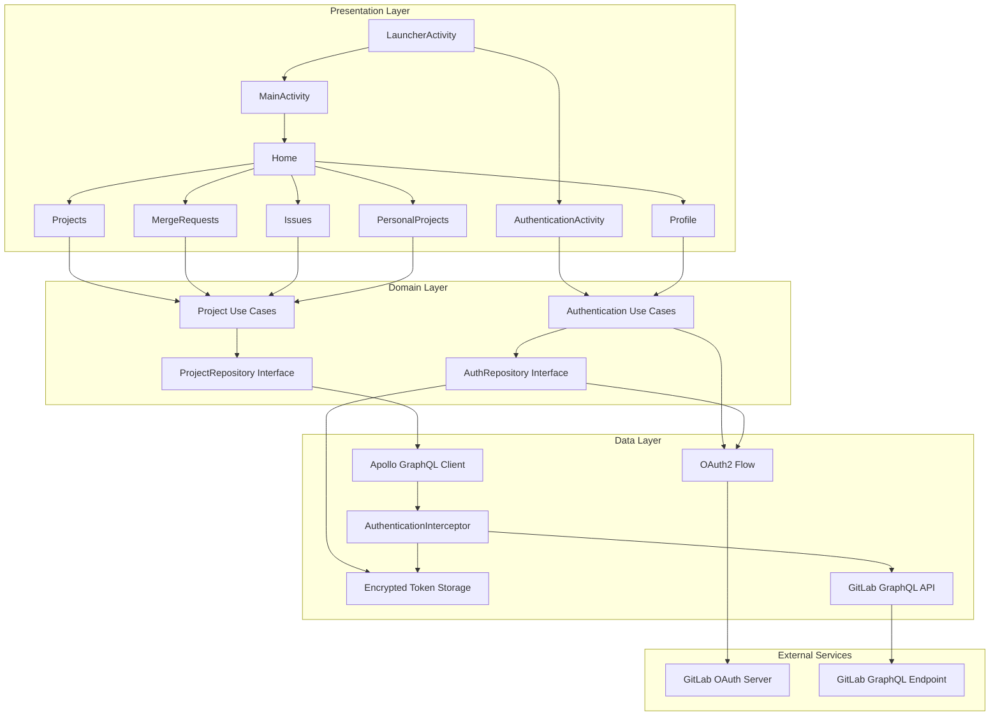
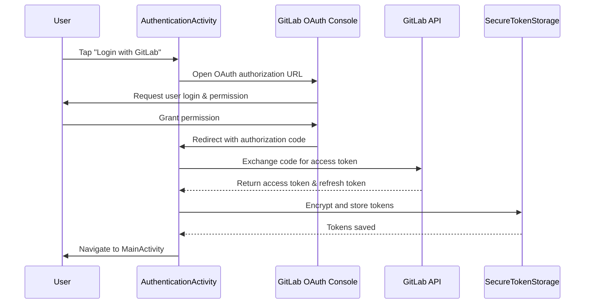
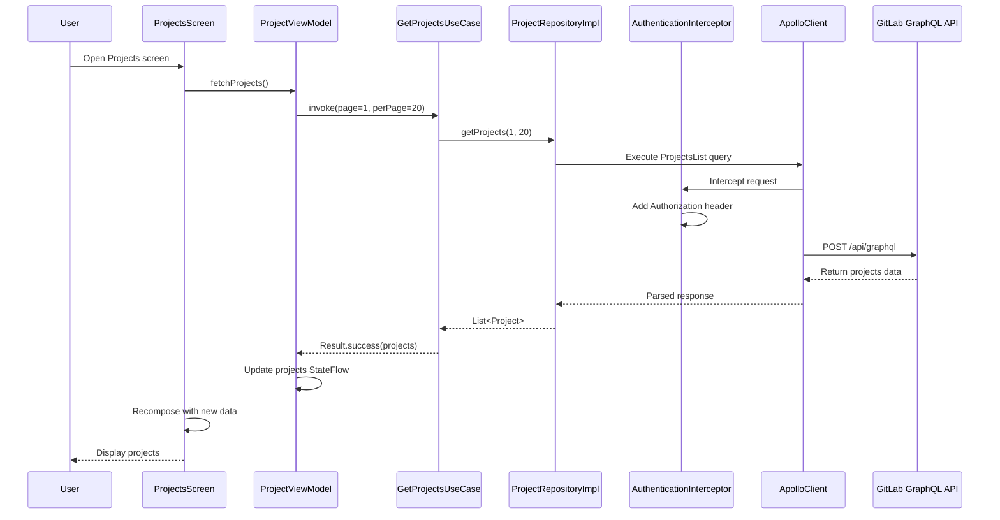
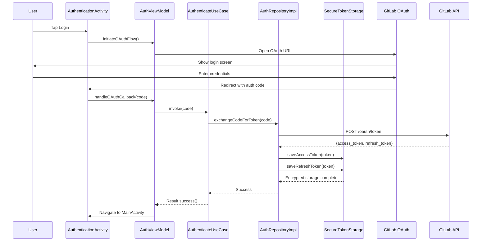

# End-to-end architecture, runtime boundaries, and request flow

# System Architecture and Application Composition

## Overview

GitLab Client is a native Android application built with Kotlin and Jetpack Compose that provides a mobile-first interface for interacting with GitLab repositories. The application follows a Clean Architecture pattern with three distinct layers: presentation using Jetpack Compose, domain logic with use cases and repositories, and data access through Apollo Kotlin GraphQL client and secure OAuth2 authentication.

The runtime boundary is layered around three main concerns: presentation in Jetpack Compose, business logic through use cases and domain models, and data access via GraphQL queries with encrypted token storage. Authentication workflows leverage GitLab's OAuth2 flow, while project data is fetched through Apollo Kotlin with OkHttp interceptors that manage secure token injection. The application bootstraps from `GitlabApp` through `LauncherActivity`, which determines navigation state based on authentication status.

## Architecture Overview



## Presentation Layer

### Application Bootstrap

*com/ahtat204/gitlab/GitlabApp.kt*

`GitlabApp` is the Android Application class that initializes Hilt dependency injection and sets up the application lifecycle.

| Property | Type | Description |
| --- | --- | --- |
| Application context | Context | Android application context for DI initialization |

| Method | Description |
| --- | --- |
| `onCreate()` | Called when the application process starts; initializes Hilt DI container |

### Launcher Activity

*com/ahtat204/gitlab/presentation/activities/LauncherActivity.kt*

`LauncherActivity` is the entry point that determines navigation state based on authentication. If a valid OAuth token exists in secure storage, the app navigates to `MainActivity`; otherwise, it routes to `AuthenticationActivity`.

| Dependency | Type | Description |
| --- | --- | --- |
| `authRepository` | `AuthRepository` | Checks for existing valid authentication tokens |

| Method | Description |
| --- | --- |
| `onCreate()` | Checks authentication state and navigates accordingly |

### Authentication Activity

*com/ahtat204/gitlab/presentation/activities/AuthenticationActivity.kt*

`AuthenticationActivity` handles the OAuth2 authorization flow. It launches the GitLab OAuth login screen, intercepts the callback with the authorization code, and exchanges it for an access token.

| Dependency | Type | Description |
| --- | --- | --- |
| `authRepository` | `AuthRepository` | Executes OAuth token exchange |

| Property | Type | Description |
| --- | --- | --- |
| `authViewModel` | `AuthViewModel` | State management for authentication flow |

| Method | Description |
| --- | --- |
| `onCreate()` | Initializes OAuth flow and callback handler |
| `handleOAuthCallback(uri: Uri)` | Processes the OAuth redirect with authorization code |

### Main Activity

*com/ahtat204/gitlab/presentation/activities/MainActivity.kt*

`MainActivity` is the main container activity that hosts the navigation graph and bottom navigation bar for switching between screens (Home, Projects, Merge Requests, Issues, Profile).

| Dependency | Type | Description |
| --- | --- | --- |
| `projectViewModel` | `ProjectViewModel` | Provides project data to child screens |

| Method | Description |
| --- | --- |
| `onCreate()` | Sets up navigation graph and bottom bar |

### Screens and Navigation

#### Navigation Graph

*com/ahtat204/gitlab/presentation/navigation/NavigationGraph.kt*

This composable function defines all screen routes and navigation destinations.

| Screen | Route | Purpose |
| --- | --- | --- |
| `Home` | `home` | Dashboard showing overview and quick actions |
| `Projects` | `projects` | List of all GitLab projects |
| `MergeRequests` | `merge_requests` | List of merge requests across projects |
| `Issues` | `issues` | List of issues across projects |
| `Profile` | `profile` | User profile and account information |
| `PersonalProjects` | `personal_projects` | User's personal projects |

#### Home Screen

*com/ahtat204/gitlab/presentation/screens/Home.kt*

Dashboard screen that displays project statistics, recent activity, and quick navigation.

| State | Type | Description |
| --- | --- | --- |
| `userInfo` | `User` | Current authenticated user information |
| `projectCount` | `Int` | Total number of projects |
| `recentActivity` | `List<Activity>` | Recent user activities |

#### Projects Screen

*com/ahtat204/gitlab/presentation/screens/Projects.kt*

Displays a paginated list of GitLab projects with search and filter capabilities.

| State | Type | Description |
| --- | --- | --- |
| `projects` | `List<Project>` | List of projects fetched from GraphQL |
| `isLoading` | `Boolean` | Loading state for pagination |
| `searchQuery` | `String` | Search term for filtering projects |

| Method | Description |
| --- | --- |
| `onProjectSelected(projectId: Int)` | Navigates to project details |
| `loadMore()` | Loads next page of projects |

#### Merge Requests Screen

*com/ahtat204/gitlab/presentation/screens/MergeRequests.kt*

Shows merge requests across all projects with filtering options.

| State | Type | Description |
| --- | --- | --- |
| `mergeRequests` | `List<MergeRequest>` | List of MRs from all projects |
| `filterState` | `MRFilter` | Current filter (open, merged, closed) |

#### Issues Screen

*com/ahtat204/gitlab/presentation/screens/Issues.kt*

Displays issues across all projects with assignment and status tracking.

| State | Type | Description |
| --- | --- | --- |
| `issues` | `List<Issue>` | List of issues from all projects |
| `selectedFilter` | `IssueFilter` | Current filter state |

#### Profile Screen

*com/ahtat204/gitlab/presentation/screens/Profile.kt*

User profile screen showing account details and account management options.

| State | Type | Description |
| --- | --- | --- |
| `userProfile` | `UserProfile` | Current user's profile information |
| `statistics` | `UserStats` | User contribution statistics |

#### Personal Projects Screen

*com/ahtat204/gitlab/presentation/screens/PersonalProjects.kt*

Displays projects owned by or directly assigned to the current user.

| State | Type | Description |
| --- | --- | --- |
| `personalProjects` | `List<Project>` | User's personal projects |

### UI Components

#### Bottom Navigation Bar

*com/ahtat204/gitlab/presentation/components/BottomBar.kt*

Reusable bottom navigation component for screen switching.

| Parameter | Type | Description |
| --- | --- | --- |
| `currentScreen` | `BottomBarScreen` | Currently selected screen |
| `onScreenSelected` | `(BottomBarScreen) -> Unit` | Callback when user selects a tab |

#### Top App Bar

*com/ahtat204/gitlab/presentation/components/TopAppBar.kt*

Header component with screen title and action buttons.

| Parameter | Type | Description |
| --- | --- | --- |
| `title` | `String` | Screen title |
| `actions` | `@Composable RowScope.() -> Unit` | Trailing action buttons |

#### Project Item

*com/ahtat204/gitlab/presentation/components/ProjectItem.kt*

Reusable card component for displaying a single project in lists.

| Parameter | Type | Description |
| --- | --- | --- |
| `project` | `Project` | Project data to display |
| `onClick` | `() -> Unit` | Callback when item is clicked |

### Theme and Styling

*com/ahtat204/gitlab/presentation/ui/theme/*

Material Design 3 theme configuration with color palette, typography, and shape definitions.

| File | Purpose |
| --- | --- |
| `Color.kt` | Color definitions for light and dark themes |
| `Theme.kt` | Material Theme composition |
| `Type.kt` | Typography and text styles |

### View Models

#### ProjectViewModel

*com/ahtat204/gitlab/presentation/viewmodels/ProjectViewModel.kt*

Manages project-related state and coordinates with domain layer use cases.

| Property | Type | Description |
| --- | --- | --- |
| `projects` | `StateFlow<List<Project>>` | Reactive projects list |
| `isLoading` | `StateFlow<Boolean>` | Loading indicator state |
| `error` | `StateFlow<String?>` | Error message state |

| Method | Description |
| --- | --- |
| `fetchProjects()` | Initiates GraphQL query for projects |
| `searchProjects(query: String)` | Searches projects by name/description |
| `fetchProjectDetails(id: Int)` | Loads detailed project information |

#### AuthViewModel

*com/ahtat204/gitlab/presentation/viewmodels/AuthViewModel.kt*

Manages authentication state and OAuth flow.

| Property | Type | Description |
| --- | --- | --- |
| `isAuthenticated` | `StateFlow<Boolean>` | Authentication status |
| `user` | `StateFlow<User?>` | Current authenticated user |

| Method | Description |
| --- | --- |
| `initiateOAuthFlow()` | Starts OAuth2 authorization |
| `handleOAuthCallback(code: String)` | Exchanges auth code for token |
| `logout()` | Clears tokens and logs out user |

## Domain Layer

### Repository Interfaces

#### ProjectRepository

*com/ahtat204/gitlab/domain/repositories/ProjectRepository.kt*

Abstract repository interface for project data operations.

| Method | Description |
| --- | --- |
| `getProjects(page: Int, perPage: Int)` | Fetches paginated project list |
| `searchProjects(query: String)` | Searches projects |
| `getProjectDetails(id: Int)` | Retrieves single project details |
| `getMergeRequests(projectId: Int)` | Gets MRs for a project |
| `getIssues(projectId: Int)` | Gets issues for a project |

#### AuthRepository

*com/ahtat204/gitlab/domain/repositories/AuthRepository.kt*

Abstract repository for authentication and token management.

| Method | Description |
| --- | --- |
| `getOAuthAuthorizationUrl()` | Generates GitLab OAuth URL |
| `exchangeCodeForToken(code: String)` | Exchanges auth code for access token |
| `refreshToken()` | Refreshes expired access token |
| `isTokenValid()` | Checks if stored token is still valid |
| `logout()` | Clears all authentication data |
| `getCurrentUser()` | Returns authenticated user information |

### Use Cases

#### GetProjectsUseCase

*com/ahtat204/gitlab/domain/usecase/projects/GetProjectsUseCase.kt*

Encapsulates the business logic for fetching projects.

```kotlin
class GetProjectsUseCase(
    private val projectRepository: ProjectRepository
) {
    suspend operator fun invoke(
        page: Int,
        perPage: Int
    ): Result<List<Project>> = runCatching {
        projectRepository.getProjects(page, perPage)
    }
}
```

#### AuthenticateUseCase

*com/ahtat204/gitlab/domain/usecase/auth/AuthenticateUseCase.kt*

Handles OAuth2 authentication flow and token exchange.

```kotlin
class AuthenticateUseCase(
    private val authRepository: AuthRepository
) {
    suspend operator fun invoke(
        authorizationCode: String
    ): Result<Unit> = runCatching {
        authRepository.exchangeCodeForToken(authorizationCode)
    }
}
```

### Domain Models

#### Project

*com/ahtat204/gitlab/domain/models/Project.kt*

Domain model representing a GitLab project.

| Property | Type | Description |
| --- | --- | --- |
| `id` | `Int` | Project identifier |
| `name` | `String` | Project name |
| `description` | `String?` | Project description |
| `url` | `String` | Project web URL |
| `visibility` | `Visibility` | Public, internal, or private |
| `starCount` | `Int` | Number of stars |
| `forkCount` | `Int` | Number of forks |
| `lastActivityAt` | `LocalDateTime?` | Last activity timestamp |
| `owner` | `User` | Project owner information |

#### MergeRequest

*com/ahtat204/gitlab/domain/models/MergeRequest.kt*

Domain model for GitLab merge requests.

| Property | Type | Description |
| --- | --- | --- |
| `id` | `Int` | MR identifier |
| `iid` | `Int` | Internal project ID |
| `title` | `String` | MR title |
| `description` | `String?` | MR description |
| `state` | `MRState` | Opened, merged, closed |
| `author` | `User` | MR author |
| `createdAt` | `LocalDateTime` | Creation timestamp |
| `updatedAt` | `LocalDateTime` | Last update timestamp |
| `mergedAt` | `LocalDateTime?` | Merge timestamp |
| `targetBranch` | `String` | Target branch name |
| `sourceBranch` | `String` | Source branch name |

#### Issue

*com/ahtat204/gitlab/domain/models/Issue.kt*

Domain model for GitLab issues.

| Property | Type | Description |
| --- | --- | --- |
| `id` | `Int` | Issue identifier |
| `iid` | `Int` | Internal project ID |
| `title` | `String` | Issue title |
| `description` | `String?` | Issue description |
| `state` | `IssueState` | Open or closed |
| `author` | `User` | Issue author |
| `assignee` | `User?` | Assigned user |
| `createdAt` | `LocalDateTime` | Creation timestamp |
| `updatedAt` | `LocalDateTime` | Last update timestamp |
| `labels` | `List<String>` | Associated labels |

#### User

*com/ahtat204/gitlab/domain/models/User.kt*

Domain model for GitLab users.

| Property | Type | Description |
| --- | --- | --- |
| `id` | `Int` | User identifier |
| `username` | `String` | GitLab username |
| `name` | `String` | User display name |
| `email` | `String?` | User email address |
| `avatarUrl` | `String?` | Avatar image URL |
| `bio` | `String?` | User biography |
| `publicEmail` | `String?` | Public email address |
| `createdAt` | `LocalDateTime` | Account creation timestamp |

## Data Layer

### Apollo GraphQL Client

#### ApolloModule

*com/ahtat204/gitlab/domain/di/ApolloModule.kt*

Hilt module that provides the Apollo GraphQL client instance with authentication interceptor.

```kotlin
@Module
@InstallIn(SingletonComponent::class)
object ApolloModule {
    
    @Provides
    @Singleton
    fun provideApolloClient(
        authInterceptor: AuthenticationInterceptor
    ): ApolloClient = ApolloClient.builder()
        .serverUrl("https://gitlab.com/api/graphql")
        .addHttpInterceptor(authInterceptor)
        .build()
}
```

### Authentication Interceptor

#### AuthenticationInterceptor

*com/ahtat204/gitlab/data/remote/AuthenticationInterceptor.kt*

OkHttp interceptor that injects OAuth access token into every GraphQL request.

| Dependency | Type | Description |
| --- | --- | --- |
| `secureStorage` | `SecureTokenStorage` | Retrieves stored access token |

| Method | Description |
| --- | --- |
| `intercept(chain: Interceptor.Chain)` | Intercepts request and adds `Authorization: Bearer <token>` header |

```kotlin
class AuthenticationInterceptor(
    private val secureStorage: SecureTokenStorage
) : Interceptor {
    override fun intercept(chain: Interceptor.Chain): Response {
        val originalRequest = chain.request()
        val token = secureStorage.getAccessToken()
        
        val authenticatedRequest = if (token != null) {
            originalRequest.newBuilder()
                .addHeader("Authorization", "Bearer $token")
                .build()
        } else {
            originalRequest
        }
        
        return chain.proceed(authenticatedRequest)
    }
}
```

### Secure Token Storage

#### SecureTokenStorage

*com/ahtat204/gitlab/data/security/SecureTokenStorage.kt*

Encrypts and stores OAuth tokens using Android's Crypto API.

| Method | Description |
| --- | --- |
| `saveAccessToken(token: String)` | Encrypts and persists access token |
| `getAccessToken(): String?` | Retrieves and decrypts access token |
| `saveRefreshToken(token: String)` | Encrypts and persists refresh token |
| `getRefreshToken(): String?` | Retrieves and decrypts refresh token |
| `clearTokens()` | Removes all stored tokens |

### Repository Implementations

#### ProjectRepositoryImpl

*com/ahtat204/gitlab/data/repositories/project/ProjectRepositoryImpl.kt*

Concrete implementation of ProjectRepository using Apollo GraphQL client.

| Dependency | Type | Description |
| --- | --- | --- |
| `apolloClient` | `ApolloClient` | GraphQL client for queries |

| Method | Description |
| --- | --- |
| `getProjects(page, perPage)` | Executes `ProjectsList` GraphQL query |
| `getProjectDetails(id)` | Executes `GetProjectDetails` GraphQL query |
| `searchProjects(query)` | Queries with search filter |

### GraphQL Queries

#### ProjectsList Query

*src/main/graphql/com/ahtat204/ProjectsList.graphql*

```graphql
query ProjectsList($page: Int!, $perPage: Int!) {
  projects(first: $perPage, after: $page) {
    edges {
      node {
        id
        name
        description
        visibility
        starCount
        owner {
          id
          username
          name
          avatarUrl
        }
        lastActivityAt
      }
    }
    pageInfo {
      hasNextPage
      endCursor
    }
  }
}
```

#### GetProjectDetails Query

*src/main/graphql/com/ahtat204/GetProjectDetails.graphql*

```graphql
query GetProjectDetails($id: ID!) {
  project(id: $id) {
    id
    name
    description
    visibility
    starCount
    forkCount
    url
    owner {
      id
      username
      name
      avatarUrl
    }
    mergeRequests(state: opened) {
      edges {
        node {
          id
          iid
          title
          state
          author {
            username
            avatarUrl
          }
        }
      }
    }
    issues(state: opened) {
      edges {
        node {
          id
          iid
          title
          state
          author {
            username
            avatarUrl
          }
        }
      }
    }
  }
}
```

### OAuth2 Flow

#### OAuthFlow Sequence



#### OAuth Configuration

*com/ahtat204/gitlab/data/remote/oauth/OAuthConfig.kt*

```kotlin
object OAuthConfig {
    const val GITLAB_CLIENT_ID = "your_client_id"
    const val GITLAB_CLIENT_SECRET = "your_client_secret"
    const val REDIRECT_URI = "gitlab://oauth-callback"
    const val AUTHORIZATION_BASE_URL = "https://gitlab.com/oauth/authorize"
    const val TOKEN_EXCHANGE_URL = "https://gitlab.com/oauth/token"
    const val SCOPES = "api read_user"
}
```

### Dependency Injection

#### ProjectRepositoryModule

*com/ahtat204/gitlab/domain/di/ProjectRepositoryModule.kt*

Hilt module providing repository implementations.

```kotlin
@Module
@InstallIn(SingletonComponent::class)
abstract class ProjectRepositoryModule {
    
    @Binds
    abstract fun bindProjectRepository(
        impl: ProjectRepositoryImpl
    ): ProjectRepository
}
```

## Data Flow Diagrams

### Project Fetching Flow



### Authentication Flow



## Build Configuration

### Root Build File

*build.gradle.kts*

Defines Kotlin version, AGP version, and shared plugin repositories.

```kotlin
plugins {
    id("com.android.application") version "8.0.0" apply false
    id("org.jetbrains.kotlin.android") version "1.9.0" apply false
    id("com.google.dagger.hilt.android") version "2.46" apply false
    id("com.apollographql.apollo") version "3.8.0" apply false
}
```

### App Build File

*app/build.gradle.kts*

Configures Android app compilation, dependencies, and Compose settings.

| Configuration | Value |
| --- | --- |
| `compileSdk` | 33 |
| `minSdk` | 24 |
| `targetSdk` | 33 |
| `buildFeatures.compose` | true |
| `composeOptions.kotlinCompilerExtensionVersion` | 1.5.0 |

### Dependency Versions

*gradle/libs.versions.toml*

Centralized version management for all dependencies.

```toml
[versions]
kotlin = "1.9.0"
compose = "1.5.0"
compose-compiler = "1.5.0"
hilt = "2.46"
apollo = "3.8.0"
okhttp = "4.10.0"
coil = "2.3.0"
material3 = "1.0.0"

[libraries]
compose-ui = { group = "androidx.compose.ui", name = "ui", version.ref = "compose" }
compose-material3 = { group = "androidx.compose.material3", name = "material3", version.ref = "material3" }
hilt-android = { group = "com.google.dagger", name = "hilt-android", version.ref = "hilt" }
apollo-runtime = { group = "com.apollographql.apollo3", name = "apollo-runtime", version.ref = "apollo" }
okhttp = { group = "com.squareup.okhttp3", name = "okhttp", version.ref = "okhttp" }
coil = { group = "io.coil-kt", name = "coil-compose", version.ref = "coil" }
```

## Testing Strategy

### Unit Tests

Test location: `app/src/test/`

- **ViewModelTests**: Test state management and use case invocation
- **UseCaseTests**: Test business logic with mocked repositories
- **RepositoryTests**: Test repository implementations with mocked Apollo client

### Integration Tests

Test location: `app/src/androidTest/`

- **NavigationTests**: Verify screen transitions and navigation graph
- **AuthenticationFlowTests**: Test OAuth flow and token management
- **ScreenTests**: Test Compose screen rendering and user interactions

## Security Considerations

### Token Management

1. **OAuth2 Redirect URI**: Custom scheme `gitlab://oauth-callback` for secure callback handling
2. **Encrypted Storage**: Tokens stored using Android Keystore encryption
3. **Token Refresh**: Automatic refresh before expiration using refresh token
4. **Secure Deletion**: Tokens cleared on logout and app data deletion

### Network Security

1. **HTTPS Only**: All API communications encrypted in transit
2. **Certificate Pinning**: Considered for production builds
3. **Request Signing**: OAuth2 token injection via AuthenticationInterceptor
4. **ProGuard Rules**: Code obfuscation for release builds

### Code Obfuscation

*app/proguard-rules.pro*

Rules to preserve API compatibility while obfuscating implementation details:

```proguard
# Preserve Apollo GraphQL generated classes
-keep class com.apollographql.apollo3.** { *; }
-keep class com.ahtat204.gitlab.data.** { *; }

# Preserve Kotlin metadata
-keepattributes *Annotation*, InnerClasses
-keep class kotlin.metadata.** { *; }
```

## Performance Optimization

### GraphQL Query Optimization

- Limit GraphQL fragment depth to prevent over-fetching
- Paginate large collections (projects, issues, MRs)
- Cache frequently accessed queries at Apollo level
- Use field aliases to reduce data payload

### UI Performance

- Lazy composition of list items
- Async image loading with Coil
- Efficient StateFlow observation
- Pagination for infinite scrolling lists

### Network Efficiency

- HTTP/2 multiplexing via OkHttp
- Gzip compression for responses
- Connection pooling and reuse
- Minimal headers and payload size

## Dependencies

### Key Libraries

| Library | Purpose | Version |
| --- | --- | --- |
| Jetpack Compose | Modern declarative UI framework | 1.5.0 |
| Apollo Kotlin | GraphQL client | 3.8.0 |
| Hilt | Dependency injection | 2.46 |
| Material Design 3 | Design components | 1.0.0 |
| Coil | Image loading | 2.3.0 |
| OkHttp | HTTP client | 4.10.0 |
| Kotlin Coroutines | Async programming | 1.7.0 |
| Android Lifecycle | Lifecycle management | 2.6.0 |

## Deployment

### Release Build Process

```bash
./gradlew bundleRelease
# or
./gradlew assembleRelease
```

### App Signing

Configure `local.properties` or keystore in gradle:

```properties
storeFile=/path/to/keystore.jks
storePassword=password
keyAlias=release
keyPassword=password
```

### Play Store Distribution

1. Upload signed APK/AAB to Google Play Console
2. Configure app listing, screenshots, and description
3. Set pricing and availability
4. Roll out staged release (5% → 25% → 50% → 100%)

## Key Classes Reference

| Class | Location | Responsibility |
| --- | --- | --- |
| `GitlabApp` | `com/ahtat204/gitlab/` | Application entry point and DI setup |
| `LauncherActivity` | `presentation/activities/` | Initial navigation routing |
| `AuthenticationActivity` | `presentation/activities/` | OAuth2 flow handling |
| `MainActivity` | `presentation/activities/` | Main app container |
| `ProjectViewModel` | `presentation/viewmodels/` | Project state management |
| `AuthViewModel` | `presentation/viewmodels/` | Authentication state |
| `ProjectRepository` | `domain/repositories/` | Project data abstraction |
| `AuthRepository` | `domain/repositories/` | Authentication abstraction |
| `ProjectRepositoryImpl` | `data/repositories/` | GraphQL project queries |
| `AuthenticationInterceptor` | `data/remote/` | Token injection middleware |
| `SecureTokenStorage` | `data/security/` | Encrypted token persistence |
| `ApolloModule` | `domain/di/` | Apollo client DI |

## Glossary

| Term | Definition |
| --- | --- |
| **OAuth2** | Open authorization standard for secure user authentication |
| **GraphQL** | Query language for APIs with client-specified data requirements |
| **Apollo Client** | GraphQL client library for consuming GraphQL APIs |
| **Jetpack Compose** | Modern Android UI toolkit with declarative API |
| **StateFlow** | Coroutine-based reactive state holder |
| **ViewModel** | Architecture component for managing UI state across reconfigurations |
| **Hilt** | Dependency injection library built on Dagger |
| **Interceptor** | OkHttp middleware for modifying requests/responses |
| **Keystore** | Android system for securely storing cryptographic keys |
