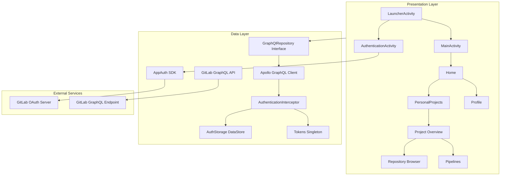
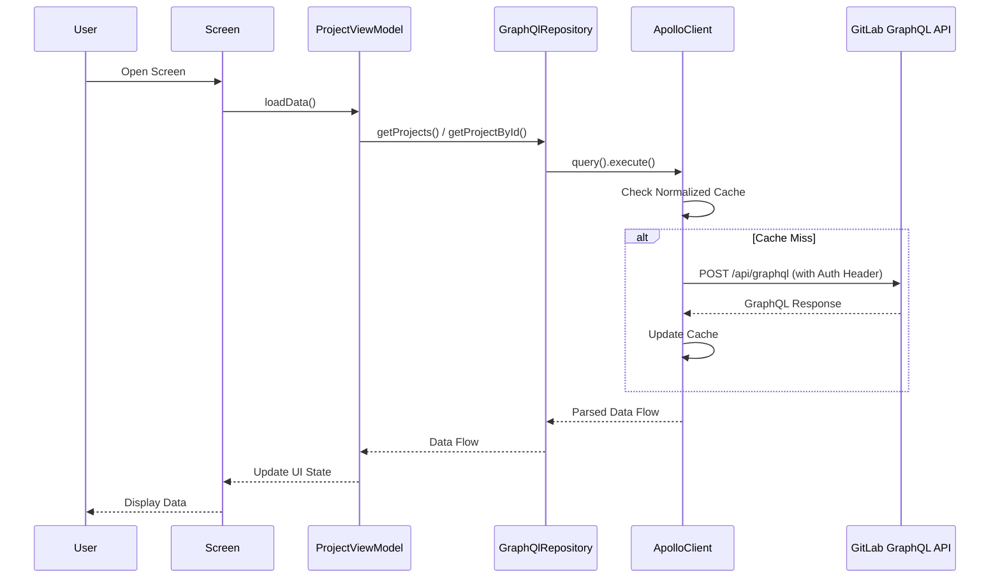

# End-to-end architecture, runtime boundaries, and request flow

# System Architecture and Application Composition

## Overview

GitLab Client is a native Android application built with Kotlin and Jetpack Compose that provides a
mobile-first interface for interacting with GitLab repositories. The application follows a modern
Android architecture pattern with a presentation layer using Jetpack Compose and ViewModels, and a
unified data access layer through Apollo Kotlin GraphQL client and secure OAuth2 authentication.

The application leverages GitLab's OAuth2 flow via the AppAuth library, while project data is
fetched through Apollo Kotlin with OkHttp interceptors that manage secure token injection and
automatic token refresh. The application bootstraps from `GitlabApp` through `LauncherActivity`,
which determines navigation state based on authentication status.

## Architecture Overview

```mermaid
flowchart TB
    subgraph PresentationLayer [Presentation Layer]
        LauncherActivity[LauncherActivity]
        AuthActivity[AuthenticationActivity]
        MainActivity[MainActivity]
        HomeScreen[Home]
        PersonalProjectsScreen[PersonalProjects]
        ProfileScreen[Profile]
        ProjectDetailScreen[Project Overview]
        RepositoryScreen[Repository Browser]
        PipelinesScreen[Pipelines]
    end

    subgraph DataLayer [Data Layer]
        GraphQlRepository[GraphQlRepository Interface]
        ApolloClient[Apollo GraphQL Client]
        AuthInterceptor[AuthenticationInterceptor]
        AuthStorage[AuthStorage DataStore]
        Tokens[Tokens Singleton]
        GitLabAPI[GitLab GraphQL API]
        AppAuth[AppAuth SDK]
    end

    subgraph ExternalServices [External Services]
        GitLabOAuth[GitLab OAuth Server]
        GitLabGraphQL[GitLab GraphQL Endpoint]
    end

    LauncherActivity --> AuthActivity
    LauncherActivity --> MainActivity
    
    AuthActivity --> AppAuth
    MainActivity --> HomeScreen
    HomeScreen --> PersonalProjectsScreen
    HomeScreen --> ProfileScreen
    
    PersonalProjectsScreen --> ProjectDetailScreen
    ProjectDetailScreen --> RepositoryScreen
    ProjectDetailScreen --> PipelinesScreen

    PresentationLayer --> GraphQlRepository
    GraphQlRepository --> ApolloClient
    
    ApolloClient --> AuthInterceptor
    AuthInterceptor --> Tokens
    AuthInterceptor --> AuthStorage
    
    AppAuth --> GitLabOAuth
    GitLabAPI --> GitLabGraphQL
```

## Presentation Layer

### Application Bootstrap

*com/ahtat204/gitlab/GitlabApp.kt*

`GitlabApp` is the Android Application class that initializes Hilt dependency injection and sets up
the application lifecycle.

### Launcher Activity

*com/ahtat204/gitlab/presentation/activities/LauncherActivity.kt*

`LauncherActivity` is the entry point that determines navigation state. It uses `AuthStorage` to
check for an existing valid authentication state. If authorized, it proceeds to `MainActivity`;
otherwise, it routes to `AuthenticationActivity`. It also handles token refresh during startup.

### Authentication Activity

*com/ahtat204/gitlab/presentation/activities/AuthenticationActivity.kt*

`AuthenticationActivity` handles the OAuth2 authorization flow using the AppAuth library. It
launches the GitLab OAuth login screen, processes the redirect, and exchanges the authorization code
for access and refresh tokens, which are then persisted in `AuthStorage`.

### Main Activity

*com/ahtat204/gitlab/presentation/activities/MainActivity.kt*

`MainActivity` is the main container activity that hosts the navigation graph and bottom navigation
bar for switching between top-level screens (Home, Profile, Activity).

### Screens and Navigation

#### Navigation Graph

*com/ahtat204/gitlab/presentation/navigation/NavigationGraph.kt*

This defines all screen routes and navigation destinations using Jetpack Compose Navigation.

| Screen | Route | Purpose |
| :--- | :--- | :--- |
| `Home` | `home` | Dashboard showing overview |
| `PersonalProjects` | `personal` | User's personal projects list |
| `Profile` | `profile` | User profile information |
| `ProjectDetail` | `project` | Overview of a specific project |
| `Repository` | `repository` | File browser for a project repository |
| `Pipelines` | `pipelines` | CI/CD pipeline history for a project |

#### Home Screen

*com/ahtat204/gitlab/presentation/screens/Home.kt*

Dashboard screen displaying top-level navigation and project summaries.

#### Personal Projects Screen

*com/ahtat204/gitlab/presentation/screens/PersonalProjects.kt*

Displays a list of GitLab projects where the user is a member or owner.

#### Project Detail Screen

*com/ahtat204/gitlab/presentation/screens/project/Overview.kt*

Displays detailed information about a selected project, including statistics and quick access to
repository and pipelines.

### View Models

#### ProjectViewModel

*com/ahtat204/gitlab/presentation/viewmodels/project/ProjectViewModel.kt*

Manages project-related state, such as fetching all personal projects or details for a specific
project.

| Method | Description |
| :--- | :--- |
| `loadAllProjects()` | Fetches user's personal projects |
| `loadProject(id)` | Loads detailed project info by ID |
| `refreshProjects()` | Invalidates cache and re-fetches project list |

#### RepositoryViewModel

*com/ahtat204/gitlab/presentation/viewmodels/project/repository/RepositoryViewModel.kt*

Manages repository tree browsing, branch selection, and commit history.

#### PipelinesViewModel

*com/ahtat204/gitlab/presentation/viewmodels/project/PipelinesViewModel.kt*

Manages CI/CD pipeline data for a project.

#### ProfileViewModel

*com/ahtat204/gitlab/presentation/viewmodels/ProfileViewModel.kt*

Manages authenticated user profile data.

## Data Layer

### Apollo GraphQL Client

#### ApolloModule

*com/ahtat204/gitlab/domain/di/ApolloModule.kt*

Hilt module providing the `ApolloClient` instance configured with a normalized memory cache,
logging, and error retry logic.

### Authentication Interceptor

#### AuthenticationInterceptor

*com/ahtat204/gitlab/data/security/AuthenticationInterceptor.kt*

OkHttp interceptor that:
1.  Injects the OAuth bearer token from `Tokens.accessToken` into every request.
2.  Intercepts `401 Unauthorized` responses to perform an automatic token refresh using AppAuth.
3.  Persists updated tokens back to `AuthStorage`.

### Auth Storage

#### AuthStorage & SafeStore

*com/ahtat204/gitlab/domain/usecase/authentication/AuthStorage.kt*
*com/ahtat204/gitlab/domain/usecase/authentication/SafeStore.kt*

Uses Jetpack DataStore to securely persist the `AuthState` (containing access and refresh tokens).
Uses a custom `AuthStateSerializer` for protobuf-like persistence of the AppAuth state object.

### Unified Repository

#### GraphQlRepository

*com/ahtat204/gitlab/data/remote/repositories/graphql/GraphQlRepository.kt*

A unified interface acting as the Single Source of Truth for all GraphQL data operations.

| Method | Description |
| :--- | :--- |
| `getAllProjects()` | Streams user's personal projects |
| `getProjectById(id)` | Streams comprehensive project overview |
| `getProjectRepository(...)` | Streams file hierarchy for a branch/path |
| `getProjectCommits(...)` | Streams paginated commit history |
| `getProjectPipelines(...)` | Streams CI/CD pipelines |
| `getMyProfile()` | Streams authenticated user profile |
| `refresh(data)` | Manually invalidates specific cache entries |

## GraphQL Queries

Queries are located in `app/src/main/graphql/com/ahtat204/`.

- `GetMyPersonalProjects.graphql`: Fetches projects for the current user.
- `GetProjectDetails.graphql`: Fetches detailed project metadata.
- `GetProjectRepository.graphql`: Queries repository file/folder structure.
- `GetRepositoryCommits.graphql`: Fetches commit logs.
- `GetProjectPipelines.graphql`: Fetches CI/CD pipeline history.
- `GetMyProfile.graphql`: Fetches user profile data.

## Data Flow

### Project Data Fetching

```mermaid
sequenceDiagram
    participant U as User
    participant S as Screen
    participant VM as ProjectViewModel
    participant R as GraphQlRepository
    participant AC as ApolloClient
    participant GA as GitLab GraphQL API

    U->>S: Open Screen
    S->>VM: loadData()
    VM->>R: getProjects() / getProjectById()
    R->>AC: query().execute()
    AC->>AC: Check Normalized Cache
    alt Cache Miss
        AC->>GA: POST /api/graphql (with Auth Header)
        GA-->>AC: GraphQL Response
        AC->>AC: Update Cache
    end
    AC-->>R: Parsed Data Flow
    R-->>VM: Data Flow
    VM-->>S: Update UI State
    S-->>U: Display Data
```

## Security Considerations

### Token Management

1.  **Encrypted Storage**: Authentication state is persisted via DataStore using `SafeStore`.
2.  **Automatic Refresh**: `AuthenticationInterceptor` handles transparent token refresh using the
    refresh token when an access token expires (401 response).
3.  **AppAuth SDK**: Uses industry-standard OpenID Connect/OAuth2 library for secure login flows via
    Custom Tabs.

### Network Security

1.  **TLS**: All communications with `gitlab.com` use HTTPS.
2.  **Interceptor-based Auth**: Tokens are injected at the network level, ensuring consistent
    security across all API calls.

## Key Classes Reference

| Class | Responsibility |
| :--- | :--- |
| `GitlabApp` | Application entry point and Hilt setup |
| `LauncherActivity` | App startup and auth state routing |
| `AuthenticationActivity` | AppAuth OAuth2 login flow |
| `MainActivity` | Main UI container and navigation host |
| `GraphQlRepository` | Centralized data access for GraphQL operations |
| `ProjectViewModel` | Project-related UI state |
| `AuthenticationInterceptor` | Token injection and automatic refresh middleware |
| `AuthStorage` | DataStore-based persistence for auth state |
| `Tokens` | Singleton holding active session token and state |
| `ApolloModule` | Configuration for Apollo Client and caching |
