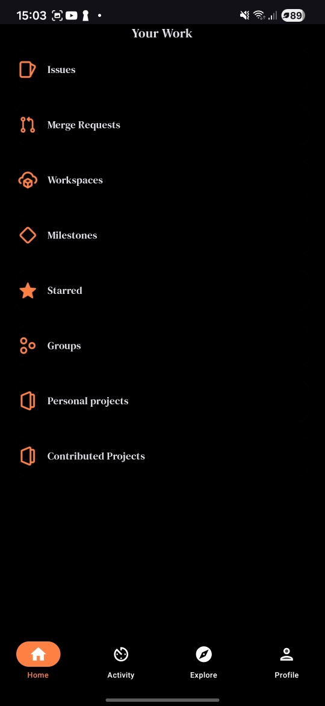
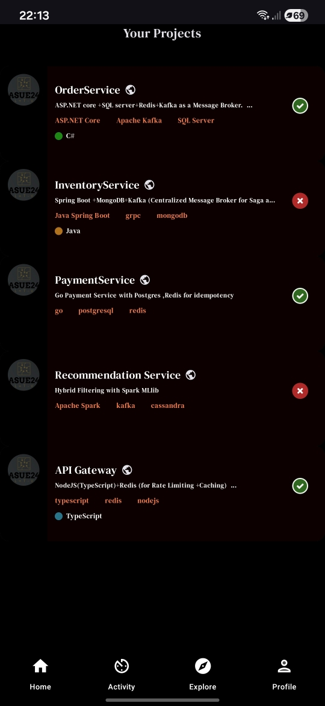
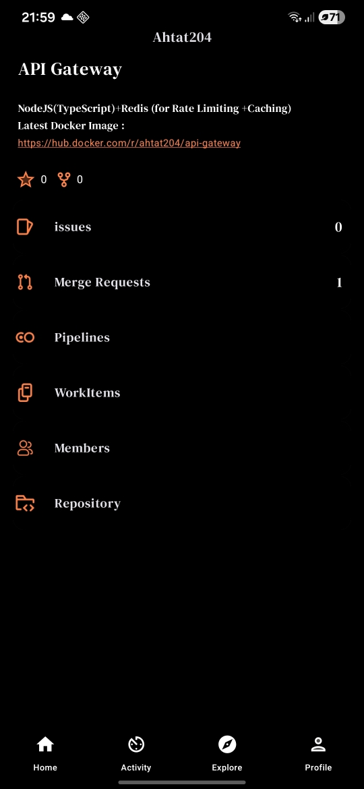
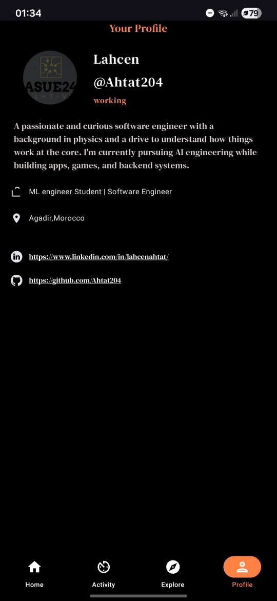
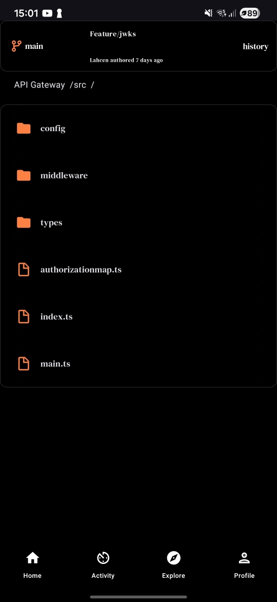
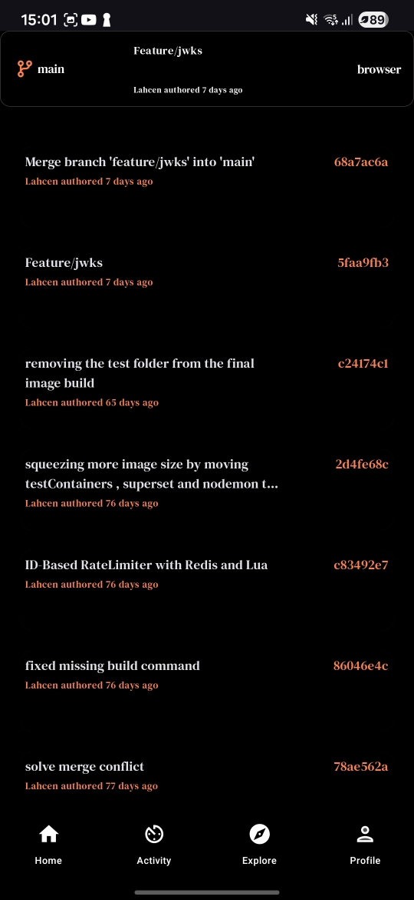

# 📱 GitLab Client

[](https://github.com/Ahtat204/Gitlab)
[](https://kotlinlang.org)
[](https://www.android.com)
[](LICENSE)

> A native Android client for GitLab that brings your repositories to your fingertips. Browse projects, view merge requests, and manage issues without opening a web browser.

## 📸 Screenshots

|       Home Screen        |             Project List              |            Project Overview            |              Profile               |              Repository               |              Commits               |  
|:------------------------:|:-------------------------------------:|:--------------------------------------:|:----------------------------------:|:-------------------------------------:|:----------------------------------:|  
|  |  |  |  |  |  |  

---

## 📑 Table of Contents

- [Overview](#overview)
- [✨ Key Features](#-key-features)
- [🛠️ Tech Stack](#️-tech-stack)
- [🚀 Quick Start](#-quick-start)
- [📁 Project Structure](#-project-structure)
- [⚙️ Configuration](#️-configuration)
- [🔒 Security](#-security)
- [📚 Architecture](#-architecture)
- [🤝 Contributing](#-contributing)
- [📄 License](#-license)

---

## Overview

**GitLab Client** is a modern Android application built with **Kotlin** and **Jetpack Compose** that provides a native, efficient way to interact with GitLab. Whether you're a developer on the go or prefer a dedicated mobile experience, this app eliminates the need to open a web browser while maintaining full access to your GitLab workspace.

The application leverages **Apollo Kotlin** for GraphQL queries and **OAuth2** for secure authentication, ensuring a seamless and secure user experience.

---

## ✨ Key Features

- 📱 **Modern Jetpack Compose UI** — Clean, responsive, and fully native Android interface built with Jetpack Compose for an intuitive user experience.
- 🔐 **GitLab OAuth2 Authentication** — Secure login using GitLab's official OAuth2 authorization flow.
- ⚡ **GraphQL Integration** — Efficient data fetching using Apollo Kotlin for optimized performance.
- 📂 **Repository Browsing** — Quickly view and navigate your GitLab projects on mobile.
- 🔍 **Project Details** — Access comprehensive project information including merge requests, issues, and statistics.
- 💾 **Secure Token Storage** — Encrypted storage of authentication tokens for safe credential management.
- 🎨 **Dark & Light Themes** — Adaptive UI themes for comfortable viewing in any lighting condition.

---

## 🛠️ Tech Stack

| Layer | Technologies |
|:---:|:---|
| **UI Framework** | Jetpack Compose, Material Design 3 |
| **Language** | Kotlin |
| **Data Layer** | Apollo Kotlin (GraphQL), OkHttp |
| **Authentication** | OAuth2 |
| **Security** | Crypto/Encryption utilities |
| **Dependency Injection** | Hilt  |
| **Image Loading** | Coil |
| **Platform** | Android (Native) |
| **Build System** | Gradle (Kotlin DSL) |

---

## 🚀 Quick Start

### Prerequisites

- Android Studio Giraffe or later
- Android SDK 24 (or higher)
- Kotlin 1.9+
- Git

### Installation

```bash
# 1. Clone the repository
git clone https://github.com/Ahtat204/Gitlab.git
cd Gitlab

# 2. Open in Android Studio
# File > Open > Select the project directory

# 3. Configure GitLab OAuth2 credentials
# Update AuthConfig.kt with your GitLab app credentials

# 4. Sync Gradle and run the app
./gradlew build
# Then run on emulator or physical device
```

### Configuration

1. **Register a GitLab Application**:
   - Go to GitLab → Preferences → Applications
   - Create a new application with redirect URI: `gitlab://oauth-callback`
   - Note your Application ID and Secret

2. **Update AuthConfig.kt**:
   ```kotlin
   object AuthConfig {
       const val GITLAB_CLIENT_ID = "your_client_id"
       const val GITLAB_CLIENT_SECRET = "your_client_secret"
       const val REDIRECT_URI = "gitlab://oauth-callback"
   }
   ```

3. **Build and Run**:
   ```bash
   ./gradlew installDebug
   ```

---

## 📁 Project Structure

```
Gitlab/
├── .gitignore
├── ARCHITECTURE.md
├── README.md
├── build.gradle.kts
├── gradle.properties
├── gradlew
├── gradlew.bat
├── local.properties
├── secrets.properties
├── settings.gradle.kts
├── projects.json
├── assets/
│   ├── homescreen.jpg
│   ├── personalprojects.jpg
│   ├── profile.jpg
│   ├── projectdetails.jpg
│   ├── projectlist.jpg
│   ├── projectsScreen.jpg
├── .github/
│   └── workflows/
│       ├── Bundle.yml
│       └── CI.yml
├── app/
│   ├── build.gradle.kts
│   ├── proguard-rules.pro
│   └── src/
│       └── main/
│           ├── AndroidManifest.xml
│           ├── graphql/
│           │   └── com/ahtat204/
│           │       ├── GetMyProfile.graphql
│           │       ├── GetProjectCommits.graphql
│           │       ├── GetProjectDetails.graphql
│           │       ├── GetProjectIssues.graphql
│           │       ├── GetProjectMRs.graphql
│           │       ├── GetProjectPipelines.graphql
│           │       ├── GetUserProjectsByName.graphql
│           │       ├── LoadMoreProjects.graphql
│           │       ├── ProjectsList.graphql
│           │       └── schema.graphqls 
│           ├── java/
│           │   └── com/ahtat204/gitlab/
│           │       ├── GitlabApp.kt
│           │       ├── data/
│           │       │   ├── remote/AuthenticationInterceptor.kt
│           │       │   ├── repositories/
│           │       │   │   ├── profile/
│           │       │   │   │   ├── ProfileRepository.kt
│           │       │   │   │   └── ProfileRepositoryImpl.kt
│           │       │   │   ├── project/
│           │       │   │   │   ├── ProjectRepository.kt
│           │       │   │   │   └── ProjectRepositoryImpl.kt
│           │       │   │   └── user/
│           │       │   │       ├── UserRepository.kt
│           │       │   │       └── UserRepositoryImpl.kt
│           │       │   └── security/CryptoUtility.kt
│           │       ├── domain/
│           │       │   ├── di/
│           │       │   │   ├── ApolloModule.kt
│           │       │   │   ├── OkHttpModule.kt
│           │       │   │   ├── ProfileRepositoryModule.kt
│           │       │   │   ├── ProjectRepositoryModule.kt
│           │       │   │   └── UserRepositoryModule.kt
│           │       │   ├── models/
│           │       │   │   ├── MergeRequest.kt
│           │       │   │   └── Project.kt
│           │       │   └── usecase/
│           │       │       ├── authentication/
│           │       │       │   ├── AuthStateSerializer.kt
│           │       │       │   ├── SafeStore.kt
│           │       │       │   ├── constants/AuthConfig.kt
│           │       │       │   ├── constants/Tokens.kt
│           │       │       │   ├── security/
│           │       │       │   │   ├── CryptoUtility.kt
│           │       │       │   │   └── SafeStore.kt
│           │       │       │   └── utility/Helper.kt
│           │       ├── presentation/
│           │       │   ├── activities/
│           │       │   │   ├── AuthenticationActivity.kt
│           │       │   │   ├── LauncherActivity.kt
│           │       │   │   └── MainActivity.kt
│           │       │   ├── components/
│           │       │   │   ├── About.kt
│           │       │   │   ├── AutoLinkText.kt
│           │       │   │   ├── Category.kt
│           │       │   │   ├── CoilCache.kt
│           │       │   │   ├── CollaborationDetails.kt
│           │       │   │   ├── CommitCard.kt
│           │       │   │   ├── Contact.kt
│           │       │   │   ├── Count.kt
│           │       │   │   ├── GeneralDetails.kt
│           │       │   │   ├── Header.kt
│           │       │   │   ├── Info.kt
│           │       │   │   ├── LanguageCircle.kt
│           │       │   │   ├── LanguagesBar.kt
│           │       │   │   ├── MergeRequestsSummary.kt
│           │       │   │   ├── PipelineStatusIcon.kt
│           │       │   │   ├── ProjectItem.kt
│           │       │   │   ├── ProjectStatistics.kt
│           │       │   │   ├── ProjectWorkItems.kt
│           │       │   │   ├── ToDoItems.kt
│           │       │   │   ├── TodoList.kt
│           │       │   │   ├── TopAppBar.kt
│           │       │   │   ├── TopBar.kt
│           │       │   │   ├── withCacheFallBack.kt
│           │       │   │   ├── WorkItem.kt
│           │       │   │   └── WorkItems.kt
│           │       │   ├── navigation/
│           │       │   │   ├── BottomBar.kt
│           │       │   │   ├── BottomBarScreen.kt
│           │       │   │   ├── NavigationGraph.kt
│           │       │   │   └── UIState.kt
│           │       │   ├── screens/
│           │       │   │   ├── Home.kt
│           │       │   │   ├── Issues.kt
│           │       │   │   ├── MergeRequests.kt
│           │       │   │   ├── PersonalProjects.kt
│           │       │   │   ├── Profile.kt
│           │       │   │   ├── ProjectCommits.kt
│           │       │   │   ├── ProjectDetailsScreen.kt
│           │       │   │   ├── Projects.kt
│           │       │   │   ├── SplashScreen.kt
│           │       │   │   └── StarrtedProjects.kt
│           │       │   ├── ui/theme/
│           │       │   │   ├── Color.kt
│           │       │   │   ├── Theme.kt
│           │       │   │   └── Type.kt
│           │       │   └── viewmodels/
│           │       │       ├── ProfileViewModel.kt
│           │       │       ├── ProjectViewModel.kt
│           │       │       ├── RepositoryViewModel.kt
│           │       │       └── UserViewModel.kt
│           └── res/
│               └── drawable/
│                   ├── commit.png
│                   ├── failed.png
│                   ├── fork.png
│                   ├── github.png
│                   ├── gitlab.png
│                   ├── group.png
│                   ├── issues.png
│                   ├── linkedin.png
│                   ├── logo.png
│                   ├── members.png
│                   ├── mergerequest.png
│                   ├── milestone.png
│                   ├── pipeline.png
│                   ├── project.png
│                   ├── repository.png
│                   ├── star.png
│                   ├── status_failed.png
│                   ├── status_success.png
│                   ├── workitems.png
│                   └── workspaces.png
├── gradle/
│   ├── libs.versions.toml
│   └── wrapper/
│       ├── gradle-wrapper.jar
│       └── gradle-wrapper.properties

```

---

## ⚙️ Configuration

### Environment Variables

```properties
# secrets.properties
CLIENT_ID: # this the Gitlab OAuth2 ClientID you get when creating an application on Gitlab , you define scope, redirect URL , you also get a Client Secret as well  
```

### Dependencies

Key dependencies are managed in `gradle/libs.versions.toml`. Update versions as needed:

- **Apollo Kotlin**: GraphQL client
- **Jetpack Compose**: UI framework
- **Coil**: Image loading library
- **OkHttp**: HTTP client with interceptors
- **Material Design 3**: Design components

---

## 🔒 Security

- **OAuth2 Flow**: Secure authentication without storing passwords
- **Encrypted Token Storage**: Access tokens are encrypted using Android's Crypto API
- **HTTPS Only**: All API communications are encrypted
- **ProGuard Rules**: Code obfuscation for production builds

### Best Practices

1. Never commit API credentials to the repository
2. Store OAuth secrets in a secure configuration file (not in version control)
3. Regularly update dependencies for security patches
4. Review GraphQL queries to minimize exposed data

---

## 📚 Architecture

This project follows **Clean Architecture** principles with a layered approach:

### Layers

1. **Presentation Layer** (UI)
   - Composable screens using Jetpack Compose
   - ViewModels for state management
   - Navigation graph for screen transitions

2. **Domain Layer** (Business Logic)
   - Use cases for business operations
   - Domain models
   - Repository interfaces

3. **Data Layer** (Data Sources)
   - Repository implementations
   - Remote data sources (API)
   - Local caching (if applicable)
   - Interceptors for request/response handling

### Design Patterns

- **MVVM**: ViewModel-based state management
- **Repository Pattern**: Abstraction of data sources
- **Dependency Injection**: Using Hilt for DI
- **Single Responsibility Principle**: Each component has one responsibility

---

## 🤝 Contributing

Contributions are welcome! Whether it's bug fixes, feature requests, or improvements, please follow these guidelines:

### Development Workflow

1. **Fork** the repository
   ```bash
   git clone https://github.com/Ahtat204/Gitlab.git
   ```

2. **Create a feature branch**
   ```bash
   git checkout -b feature/your-feature-name
   ```

3. **Make your changes**
   - Follow Kotlin coding conventions
   - Add comments for complex logic
   - Test your changes locally

4. **Commit with clear messages**
   ```bash
   git commit -m "feat: add awesome feature"
   # or
   git commit -m "fix: resolve issue with X"
   ```

5. **Push to your fork**
   ```bash
   git push origin feature/your-feature-name
   ```

6. **Open a Pull Request**
   - Provide a clear description of your changes
   - Link to any related issues
   - Include screenshots for UI changes

### Commit Convention

- `feat:` - New feature
- `fix:` - Bug fix
- `refactor:` - Code refactoring
- `docs:` - Documentation
- `style:` - Code style (formatting, etc.)
- `test:` - Adding or updating tests
- `chore:` - Build, dependencies, etc.

### Code Style

- Follow [Kotlin coding conventions](https://kotlinlang.org/docs/coding-conventions.html)
- Use meaningful variable and function names
- Keep functions small and focused
- Add KDoc comments for public APIs

---

## 🙏 Acknowledgments

- [GitLab](https://gitlab.com) for the GraphQL API
- [Jetpack Compose](https://developer.android.com/jetpack/compose) for the modern UI framework
- [Apollo Kotlin](https://www.apollographql.com/docs/kotlin/) for GraphQL client
- The Android development community

---

## 📞 Support

Have questions or found a bug? 

- Open an [Issue](https://github.com/Ahtat204/Gitlab/issues)
- Check existing issues for similar problems
- Provide detailed error messages and reproduction steps

---
